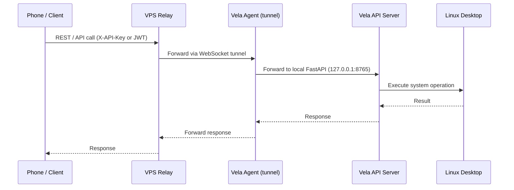
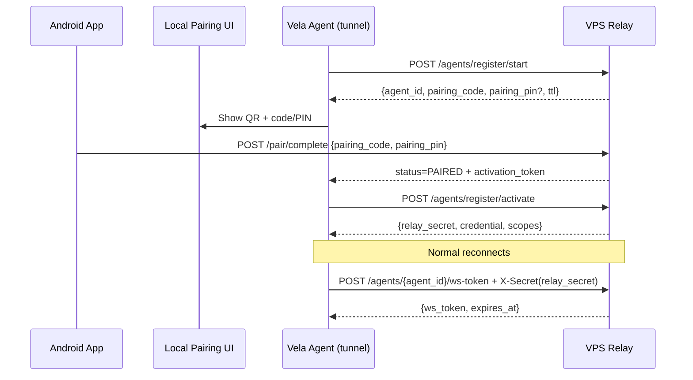

# Vela RemotePC Agent

**Control your Linux desktop from anywhere — via chat, API, or WebSocket tunnel.**

Vela is a FastAPI-based remote PC agent for Linux. It exposes your desktop's capabilities (filesystem, audio, display, processes, notifications, power management, etc.) through a secure REST API, optionally tunneled through a WebSocket relay for remote access.

## Features

- **Full system control API** — filesystem, audio, display, power, notifications, network, input control, system info, monitoring, processes, security, scheduler, maintenance, media, clipboard, Spotify, alerts
- **LLM-powered assistant** — natural language chat interface via Fireworks AI with tool-calling
- **WebSocket tunnel** — connect to a remote VPS relay to access your PC from anywhere
- **Agent onboarding** — browser-based QR pairing with code/PIN fallback
- **JWT authentication** — bcrypt-hashed passwords, bearer token auth, rate-limited
- **Filesystem access control** — whitelist-based directory permissions
- **Rate limiting** — per-endpoint rate limits (default 150/min, auth endpoints 10/min)
- **systemd integration** — runs as user services with auto-restart

## Architecture

Vela connects your phone to your Linux desktop through a secure relay. Here's how the data flows:

### Direct command flow (e.g. "Lock screen", "List files")



### AI assistant flow (e.g. "How much storage do I have left?")


### Registration flow



### The role of each layer

| Layer | Does | Doesn't |
|-------|------|---------|
| **Phone / Client** | Sends requests, displays results | Parse commands, execute anything |
| **VPS Relay** | Routes requests via WebSocket, manages agent registration | Execute system operations, understand intent |
| **Vela Agent (tunnel)** | Maintains WebSocket tunnel to VPS, forwards requests to local API server | Execute system operations, communicate with LLM |
| **Vela API Server** | Executes system operations via routers, handles AI chat with LLM, enforces auth & safety | Connect to the VPS directly — the agent handles that |
| **LLM (Fireworks AI)** | Understands natural language, selects tools, summarizes results | Execute system calls — the API server handles that |
| **Linux Desktop** | Runs the actual system (files, processes, audio, etc.) | Make decisions — it just follows OS calls |

## Quick Start

### Prerequisites

#### System Requirements

- **Python 3.13+**
- **Linux desktop** (X11 or Wayland)

#### Required System Packages

Most of these are typically pre-installed on a modern Linux desktop. Missing tools affect only the corresponding feature.

| Feature | Required Commands | Install (Debian/Ubuntu) | Install (Fedora) | Install (Arch) |
|---------|------------------|------------------------|------------------|----------------|
| **Filesystem** | `xdg-open` | `xdg-utils` | `xdg-utils` | `xdg-utils` |
| **Audio** | `amixer`, `pactl`, `canberra-gtk-play` | `alsa-utils`, `pulseaudio-utils`, `libcanberra-gtk-module` | `alsa-utils`, `pulseaudio-utils`, `libcanberra-gtk3` | `alsa-utils`, `pulseaudio-utils`, `libcanberra` |
| **Display / Screenshot** | `xrandr`, `flameshot`, `xset`, `ffmpeg`, `busctl`, `brightnessctl`, `gsettings`, `loginctl`, `swaymsg` | `x11-xserver-utils`, `flameshot`, `x11-xserver-utils`, `ffmpeg`, `libglib2.0-bin`, `brightnessctl`, `systemd` | `xorg-xrandr`, `flameshot`, `xorg-xset`, `ffmpeg`, `glib2`, `brightnessctl`, `systemd` | `xorg-xrandr`, `flameshot`, `xorg-xset`, `ffmpeg`, `glib2`, `brightnessctl`, `systemd` |
| **Input Control** | `xdotool`, `xprop`, `xwininfo` | `xdotool`, `x11-utils` | `xdotool`, `xorg-xprop`, `xorg-xwininfo` | `xdotool`, `xorg-xprop`, `xorg-xwininfo` |
| **Media** | `playerctl` | `playerctl` | `playerctl` | `playerctl` |
| **Network** | `nmcli`, `bluetoothctl`, `rfkill`, `ping`, `speedtest-cli` | `network-manager`, `bluez`, `util-linux`, `iputils-ping`, `speedtest-cli` | `NetworkManager`, `bluez`, `util-linux`, `iputils`, `speedtest-cli` | `networkmanager`, `bluez`, `util-linux`, `iputils`, `speedtest-cli` |
| **Notifications** | `notify-send`, `dunstctl` | `libnotify-bin`, `dunst` | `libnotify`, `dunst` | `libnotify`, `dunst` |
| **Power** | `systemctl`, `powerprofilesctl` | `systemd`, `power-profiles-daemon` | `systemd`, `power-profiles-daemon` | `systemd`, `power-profiles-daemon` |
| **Processes** | `xdotool`, `xprop`, `xwininfo` | `xdotool`, `x11-utils` | `xdotool`, `xorg-xprop`, `xorg-xwininfo` | `xdotool`, `xorg-xprop`, `xorg-xwininfo` |
| **Security** | `loginctl`, `modprobe`, `pactl`, `pkill`, `last`, `who`, `ffmpeg` | `systemd`, `kmod`, `pulseaudio-utils`, `procps`, `util-linux`, `coreutils`, `ffmpeg` | `systemd`, `kmod`, `pulseaudio-utils`, `procps-ng`, `util-linux`, `coreutils`, `ffmpeg` | `systemd`, `kmod`, `pulseaudio-utils`, `procps-ng`, `util-linux`, `coreutils`, `ffmpeg` |
| **System Info** | `lspci`, `lsusb`, `dmidecode`, `nvidia-smi`, `xrandr` | `pciutils`, `usbutils`, `dmidecode`, `nvidia-smi`, `x11-xserver-utils` | `pciutils`, `usbutils`, `dmidecode`, `nvidia-smi`, `xorg-xrandr` | `pciutils`, `usbutils`, `dmidecode`, `nvidia-smi`, `xorg-xrandr` |
| **Maintenance** | `journalctl`, `systemctl`, `timedatectl`, `apt-get`/`dnf`/`pacman` | `systemd` | `systemd` | `systemd` |
| **Monitoring** | `nvidia-smi` | `nvidia-smi` (NVIDIA GPU only) | `nvidia-smi` (NVIDIA GPU only) | `nvidia-smi` (NVIDIA GPU only) |

> 💡 **Tip:** Run `which <command>` to check if a particular tool is already installed.
> Missing tools won't crash the app — the corresponding endpoint will return an appropriate error.

#### Optional Dependencies

- Fireworks AI API key (for the LLM-powered assistant at `/assistant/chat`)
- Resend API key (for email alerts — CPU/memory spike alerts and daily summaries)
- Spotify Developer credentials (for Spotify playback control)

### Setup

From source:

```bash
git clone https://github.com/mikesplore/vela.git
cd vela

# Run the setup script — it will ask you a few questions
# and generate everything automatically
./setup.sh
```

If Vela is installed globally (for example via pip), run:

```bash
pip install mikesplore-vela
vela --setup
```

This will:
- Wipe cached local auth tokens and relay credentials (fresh start)
- Prompt for credentials, VPS URL, and agent label
- Generate a `config.yaml` and fresh `.env` (empty relay secrets until pairing)
- Verify the VPS relay is reachable
- Force pairing, then restart `vela.service` and `vela-agent.service` so only the new credentials are used

> 💡 **VPS relay:** You can use the free relay at `vela.mikesplore.tech` or specify your own.
>
> `./setup.sh` also creates a virtual environment and installs Vela from the current source tree. A globally installed `vela --setup` only runs setup.
>
> Setup links `vela` and `vela-agent` into `~/.local/bin` so the commands work outside the virtualenv (as long as that directory is on your `PATH`).

### Post-Setup

Optional integrations (Fireworks, Resend, Spotify) can be filled during `vela --setup`.
If you skipped them, open `.env` afterward and add the keys you need:

```bash
nano .env
```

At minimum, set your **Fireworks AI API key** if you want the assistant:

```
FIREWORKS_API_KEY='your-actual-key-here'
```

If you want email alerts, also set:

```
RESEND_API_KEY='your-resend-key'
RECIPIENT_EMAIL='your-email@example.com'
```

Then manage services with:

```bash
vela --enable
```

OpenAPI docs available at `http://127.0.0.1:8765/docs`.

Common commands:

```bash
vela --setup
vela --start
vela --stop
vela --restart
vela --status
vela --logs
vela-agent --start
vela-agent --stop
```

> `vela --setup` is the only onboarding path. It always starts fresh (no credential reuse).
> After editing `.env`, run `vela --restart` so both services reload the new values.

## Agent Registration

Vela uses pairing-based onboarding (`2026-07-pairing-v1`). The agent always initiates outbound requests; VPS never initiates to the device.

### 1) Start pairing session

Agent calls `POST /agents/register/start`:

```bash
curl -X POST http://<vps-url>:8000/agents/register/start \
  -H "Content-Type: application/json" \
  -d '{"agent_name":"my-agent","device_info":{"device_fingerprint":"host:user"}}'
```

VPS returns `agent_id`, `pairing_code`, optional `pairing_pin`, and `pairing_expires_in`.  
The agent creates the QR payload locally from the VPS URL, pairing code, and optional PIN, then shows it with a manual code/PIN fallback.

### 2) Android completes pair

Android app sends:

```bash
curl -X POST http://<vps-url>:8000/pair/complete \
  -H "Content-Type: application/json" \
  -d '{"pairing_code":"<code>","pairing_pin":"<pin>","agent_label":"My Phone"}'
```

Agent polls `GET /agents/register/status?agent_id=...` until it gets `PAIRED` + `activation_token`, then immediately calls activation. If activation reports an invalid token, the agent fetches status once and retries activation once with the returned token before it requests a new pairing session.

### 3) Agent activates

```bash
curl -X POST http://<vps-url>:8000/agents/register/activate \
  -H "Content-Type: application/json" \
  -d '{"agent_id":"<agent-id>","activation_token":"<one-time-token>"}'
```

VPS returns `relay_secret`, `credential`, and scopes.  
Agent persists:

- `RELAY_SECRET` (primary secret for VPS auth)
- `AGENT_CREDENTIAL` (returned credential)
- `AGENT_ID`

### 4) Runtime reconnect

On normal reconnect:

```bash
curl -X POST http://<vps-url>:8000/agents/<agent-id>/ws-token \
  -H "X-Secret: <relay-secret>"
```

Then agent connects `ws(s)://<vps>/tunnel?agent_id=<id>&token=<ws_token>`.

## Configuration

Vela uses two configuration sources:

- **`config.yaml`** — server settings (host, port, secret key, feature flags, etc.)
- **`.env`** — agent credentials/secrets (`RELAY_SECRET`, `AGENT_CREDENTIAL`, API keys, etc.)

### config.yaml

```yaml
host: 127.0.0.1
port: 8765
secret_key: <32+ character random string>
token_expire_minutes: 1440
username: admin
password_hash: <bcrypt hash>
log_level: INFO

allowed_origins: []
allowed_base_dirs:
  - /home/youruser

# Rate limiting
rate_limit_default: 100/minute
route_rate_limits:
  /auth/token: 10/minute
  /ping: 60/minute

# Feature flags
feature_flags:
  display: true
  audio: true
  power: true
  notifications: true
  network: true
  filesystem: true
  input_control: true
  system_info: true
  monitoring: true
  processes: true
  security: true
  scheduler: true
  maintenance: true
  media: true
  clipboard: true

# Fireworks AI assistant
fireworks_api_url: https://api.fireworks.ai/inference/v1
fireworks_api_key: <your-api-key>
fireworks_model: accounts/fireworks/models/qwen3p7-plus
assistant_system_prompt: "You are Vela..."
assistant_action_pin: null
assistant_action_timeout_seconds: 120
assistant_enable_thinking: false
```

### Environment variables (.env)

See [.env.example](.env.example) for the full list. Key variables:

| Variable | Description |
|----------|-------------|
| `VPS_URL` | VPS relay URL (e.g. `http://your-vps:8000`) |
| `AGENT_ID` | VPS-issued agent identifier after pairing |
| `RELAY_SECRET` | Primary long-lived secret used as `X-Secret` for relay auth |
| `AGENT_CREDENTIAL` | Agent activation credential returned by `/agents/register/activate` |
| `AGENT_SECRET` | Backward-compatible alias (currently mirrors `RELAY_SECRET`) |
| `PUBLIC_ADDRESS` | Public address of this agent (optional, first registration) |
| `METADATA` | JSON metadata for agent registration (optional) |
| `FIREWORKS_API_KEY` | Fireworks AI API key for the LLM assistant |
| `RESEND_API_KEY` | Resend API key for email alerts |
| `RECIPIENT_EMAIL` | Email address for alert notifications |
| `SPOTIFY_CLIENT_ID` | Spotify Developer client ID |
| `SPOTIFY_CLIENT_SECRET` | Spotify Developer client secret |

## API Endpoints

### Authentication

- `POST /auth/token` — Login, returns JWT bearer token
- `GET /auth/me` — Get current user

### System Routers

| Prefix | Description |
|--------|-------------|
| `/filesystem` | Read/write files, list directories |
| `/audio` | Volume control, audio output switching |
| `/display` | Screen lock, display info |
| `/power` | Shutdown, reboot, suspend |
| `/notifications` | Send desktop notifications |
| `/network` | Network info, WiFi management |
| `/input_control` | Mouse/keyboard control |
| `/system_info` | OS, hardware, resource info |
| `/monitoring` | CPU, memory, disk monitoring |
| `/processes` | List/kill processes |
| `/security` | Screen lock, webcam control, login history |
| `/scheduler` | Task scheduling |
| `/maintenance` | System maintenance tasks |
| `/media` | Media playback control |
| `/clipboard` | Clipboard read/write |
| `/alerts` | Spike monitoring and email alerts |
| `/spotify` | Spotify playback and search |

### Assistant

- `POST /assistant/chat` — Natural language chat with LLM-powered tool calling
- `POST /assistant/stream` — Streaming (SSE) version of the chat endpoint

### Health

- `GET /` — Root info (name, version, enabled modules)
- `GET /health` — Service health check
- `GET /ping` — Connectivity check

## Assistant (LLM Integration)

Vela includes a Fireworks AI-powered chat assistant at `/assistant/chat`. It uses Qwen models with tool-calling to map natural language to system operations.

```bash
curl -X POST http://127.0.0.1:8765/assistant/chat \
  -H "Authorization: Bearer <jwt-token>" \
  -H "Content-Type: application/json" \
  -d '{"message": "How much storage do I have left?"}'
```

The assistant:
- Parses natural language into intent
- Selects the appropriate system tool (filesystem, processes, etc.)
- Returns a human-readable response with the result
- Supports streaming responses via `/assistant/stream`
- Requires PIN confirmation for destructive actions (configurable)

## Security

- **JWT authentication** — all routes require a valid bearer token (except `/auth/token`)
- **Rate limiting** — auth endpoints limited to 10 req/min, default 150/min
- **Filesystem whitelist** — restrict directory access
- **Destructive action confirmation** — file deletion, power operations require explicit action confirmation
- **Optional PIN gate** — high-risk AI actions can require a PIN

## Development

### Project Structure

```
vela/
├── app/
│   ├── __init__.py
│   ├── main.py              # FastAPI application entry point
│   ├── auth.py               # JWT authentication
│   ├── dependencies.py       # FastAPI dependencies
│   ├── middleware.py          # Request logging
│   ├── prompts.py            # Assistant system prompts
│   ├── rate_limiter.py        # Rate limiting setup
│   ├── agent/
│   │   ├── __init__.py
│   │   ├── agent.py          # Agent CLI entry point
│   │   ├── helpers.py        # Agent onboarding and tunnel orchestration
│   │   └── tunnel.py         # WebSocket tunnel implementation
│   ├── setup/                # Fresh-start setup (wipe, write config, pair, restart)
│   ├── ui/                   # Browser pairing + setup wizard pages
│   ├── db/
│   │   ├── __init__.py
│   │   ├── models.py         # Database models
│   │   └── pending_actions.py # Pending action storage
│   ├── domain/               # Domain models (schemas)
│   │   ├── __init__.py
│   │   ├── assistant.py
│   │   ├── audio.py
│   │   ├── ...
│   │   └── system_info.py
│   ├── routers/              # System operation routers
│   │   ├── __init__.py
│   │   ├── filesystem.py
│   │   ├── audio.py
│   │   ├── ...
│   │   └── system_info.py
│   ├── services/             # Business logic
│   │   ├── __init__.py
│   │   ├── filesystem.py
│   │   ├── audio.py
│   │   ├── ...
│   │   └── system_info.py
│   │   └── assistant/        # LLM assistant service
│   │       ├── __init__.py
│   │       ├── helpers.py
│   │       ├── prompts.py
│   │       ├── safety.py
│   │       ├── stream.py
│   │       └── tools.py
│   └── utils/
│       ├── __init__.py
│       ├── config.py         # Configuration loading (pydantic-settings)
│       ├── errors.py         # Error response models
│       ├── input_header.py   # Input header helper
│       ├── run_command.py    # Shell command execution
│       └── spotify_client.py # Spotify API client
├── tests/                    # Test suite
│   ├── routers/
│   ├── services/
│   └── db/
├── .env.example              # Environment variable template
├── config.yaml               # Local configuration (generated)
├── setup.sh                  # Setup script
├── pyproject.toml            # Python package metadata
└── README.md
```

### Adding a Route

1. Add a service file under `app/services/` for business logic (if needed)
2. Add a router file under `app/routers/` with endpoint definitions
3. Export the router in `app/routers/__init__.py`
4. Add `feature_flags` entry in `config.yaml` if needed
5. Add a domain model in `app/domain/` if new schemas are needed
6. Add tests under `tests/`

## Running Tests

```bash
python -m pytest
```

## License

[MIT](LICENSE)