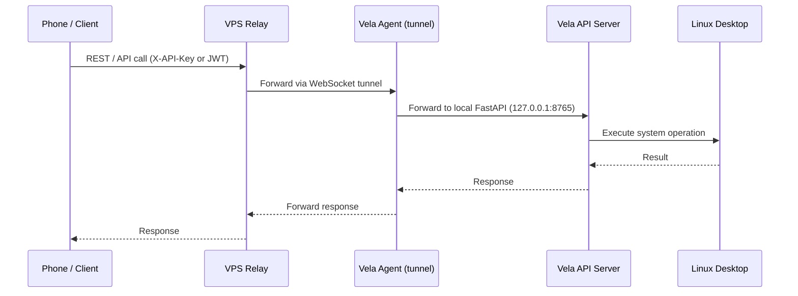
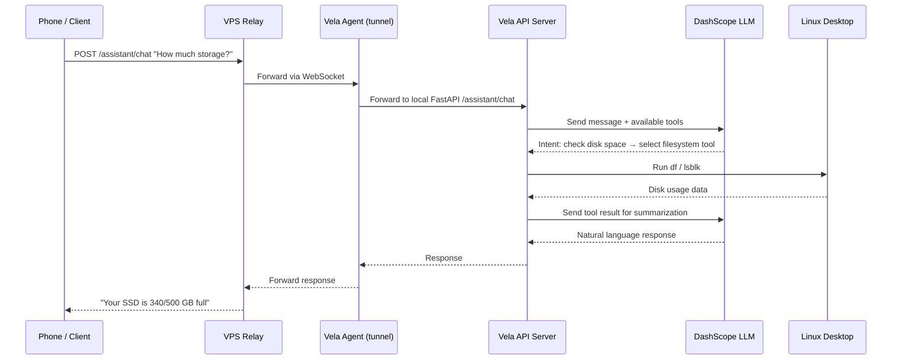
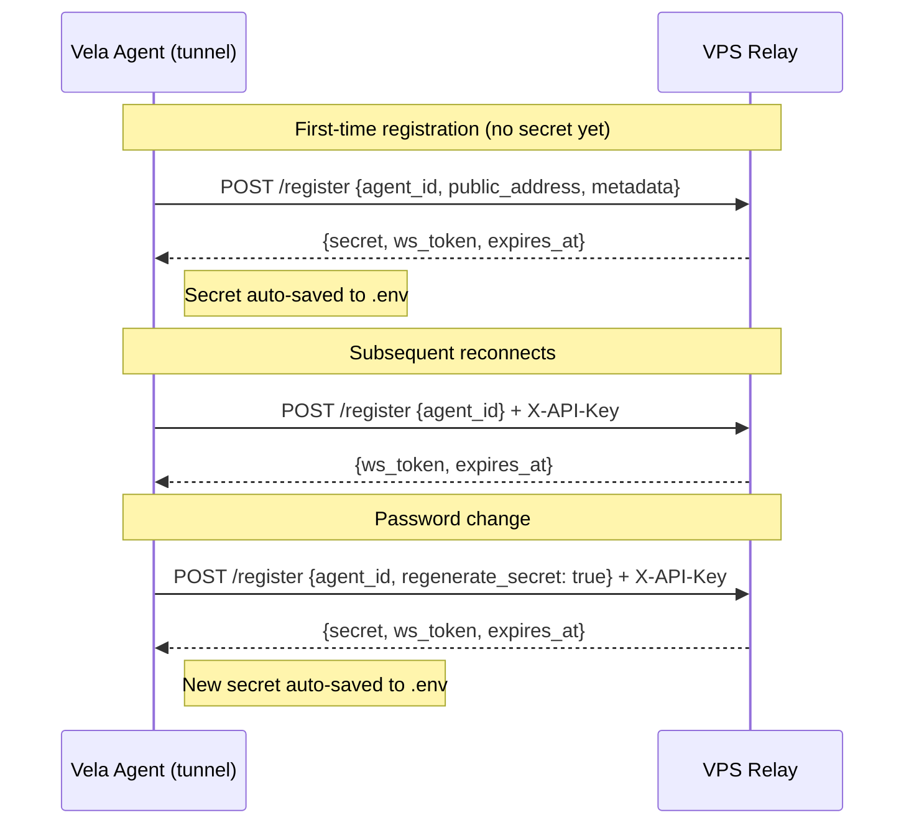

# Vela RemotePC Agent

**Control your Linux desktop from anywhere — via chat, API, or WebSocket tunnel.**

Vela is a FastAPI-based remote PC agent for Linux. It exposes your desktop's capabilities (filesystem, audio, display, processes, notifications, power management, etc.) through a secure REST API, optionally tunneled through a WebSocket relay for remote access.

## Features

- **Full system control API** — filesystem, audio, display, power, notifications, network, input control, system info, monitoring, processes, security, scheduler, maintenance, media, clipboard
- **LLM-powered assistant** — natural language chat interface via DashScope's Qwen model with tool-calling
- **WebSocket tunnel** — connect to a remote VPS relay to access your PC from anywhere
- **Agent registration** — one-time registration with a VPS; automatic secret rotation
- **JWT authentication** — bcrypt-hashed passwords, bearer token auth, rate-limited
- **IP allowlisting** — restrict API access to specific IPs
- **Filesystem access control** — whitelist-based directory permissions
- **Rate limiting** — per-endpoint rate limits (default 100/min, auth endpoints 10/min)
- **systemd integration** — runs as user services with auto-restart

## Architecture

Vela connects your phone to your Linux desktop through a secure relay. Here's how the data flows:

### Direct command flow (e.g. "Lock screen", "List files")



### AI assistant flow (e.g. "How much storage do I have left?")



### Registration flow



### The role of each layer

| Layer | Does | Doesn't |
|-------|------|---------|
| **Phone / Client** | Sends requests, displays results | Parse commands, execute anything |
| **VPS Relay** | Routes requests via WebSocket, manages agent registration | Execute system operations, understand intent |
| **Vela Agent (tunnel)** | Maintains WebSocket tunnel to VPS, forwards requests to local API server | Execute system operations, communicate with LLM |
| **Vela API Server** | Executes system operations via routers, handles AI chat with LLM, enforces auth & safety | Connect to the VPS directly — the agent handles that |
| **LLM (DashScope)** | Understands natural language, selects tools, summarizes results | Execute system calls — the API server handles that |
| **Linux Desktop** | Runs the actual system (files, processes, audio, etc.) | Make decisions — it just follows OS calls |

## Quick Start

### Prerequisites

#### System Requirements

- **Python 3.13+**
- **Linux desktop** (X11 or Wayland)

#### Required System Packages

Most of these are typically pre-installed on a modern Linux desktop. Missing tools affect only the corresponding feature.

| Feature | Required Commands | Install (Debian/Ubuntu) | Install (Fedora) | Install (Arch) |
|---------|------------------|------------------------|------------------|----------------|
| **Filesystem** | `xdg-open` | `xdg-utils` | `xdg-utils` | `xdg-utils` |
| **Audio** | `amixer`, `pactl`, `canberra-gtk-play` | `alsa-utils`, `pulseaudio-utils`, `libcanberra-gtk-module` | `alsa-utils`, `pulseaudio-utils`, `libcanberra-gtk3` | `alsa-utils`, `pulseaudio-utils`, `libcanberra` |
| **Display / Screenshot** | `xrandr`, `flameshot`, `xset`, `ffmpeg`, `busctl`, `brightnessctl`, `gsettings`, `loginctl`, `swaymsg` | `x11-xserver-utils`, `flameshot`, `x11-xserver-utils`, `ffmpeg`, `libglib2.0-bin`, `brightnessctl`, `systemd` | `xorg-xrandr`, `flameshot`, `xorg-xset`, `ffmpeg`, `glib2`, `brightnessctl`, `systemd` | `xorg-xrandr`, `flameshot`, `xorg-xset`, `ffmpeg`, `glib2`, `brightnessctl`, `systemd` |
| **Input Control** | `xdotool`, `xprop`, `xwininfo` | `xdotool`, `x11-utils` | `xdotool`, `xorg-xprop`, `xorg-xwininfo` | `xdotool`, `xorg-xprop`, `xorg-xwininfo` |
| **Media** | `playerctl` | `playerctl` | `playerctl` | `playerctl` |
| **Network** | `nmcli`, `bluetoothctl`, `rfkill`, `ping`, `speedtest-cli` | `network-manager`, `bluez`, `util-linux`, `iputils-ping`, `speedtest-cli` | `NetworkManager`, `bluez`, `util-linux`, `iputils`, `speedtest-cli` | `networkmanager`, `bluez`, `util-linux`, `iputils`, `speedtest-cli` |
| **Notifications** | `notify-send`, `dunstctl` | `libnotify-bin`, `dunst` | `libnotify`, `dunst` | `libnotify`, `dunst` |
| **Power** | `systemctl`, `powerprofilesctl` | `systemd`, `power-profiles-daemon` | `systemd`, `power-profiles-daemon` | `systemd`, `power-profiles-daemon` |
| **Processes** | `xdotool`, `xprop`, `xwininfo` | `xdotool`, `x11-utils` | `xdotool`, `xorg-xprop`, `xorg-xwininfo` | `xdotool`, `xorg-xprop`, `xorg-xwininfo` |
| **Security** | `loginctl`, `modprobe`, `pactl`, `pkill`, `last`, `who`, `ffmpeg` | `systemd`, `kmod`, `pulseaudio-utils`, `procps`, `util-linux`, `coreutils`, `ffmpeg` | `systemd`, `kmod`, `pulseaudio-utils`, `procps-ng`, `util-linux`, `coreutils`, `ffmpeg` | `systemd`, `kmod`, `pulseaudio-utils`, `procps-ng`, `util-linux`, `coreutils`, `ffmpeg` |
| **System Info** | `lspci`, `lsusb`, `dmidecode`, `nvidia-smi`, `xrandr` | `pciutils`, `usbutils`, `dmidecode`, `nvidia-smi`, `x11-xserver-utils` | `pciutils`, `usbutils`, `dmidecode`, `nvidia-smi`, `xorg-xrandr` | `pciutils`, `usbutils`, `dmidecode`, `nvidia-smi`, `xorg-xrandr` |
| **Maintenance** | `journalctl`, `systemctl`, `timedatectl`, `apt-get`/`dnf`/`pacman` | `systemd` | `systemd` | `systemd` |
| **Monitoring** | `nvidia-smi` | `nvidia-smi` (NVIDIA GPU only) | `nvidia-smi` (NVIDIA GPU only) | `nvidia-smi` (NVIDIA GPU only) |

> 💡 **Tip:** Run `which <command>` to check if a particular tool is already installed.
> Missing tools won't crash the app — the corresponding endpoint will return an appropriate error.

#### Optional Python Dependencies (for the assistant)

- DashScope API key (for the LLM-powered assistant at `/assistant/chat`)

### Development Setup

```bash
git clone https://github.com/mikesplore/vela.git
cd vela

# Create virtual environment and install
python -m venv .venv
source .venv/bin/activate
pip install -e .

# Copy config and customize
cp config.yaml.example config.yaml
# Edit config.yaml with your settings

# Run
vela
```

OpenAPI docs available at `http://127.0.0.1:8765/docs`.

### Production Setup

```bash
./setup.sh
```

This will:
- Prompt for credentials, VPS URL, agent ID
- Generate a `config.yaml` and `.env`
- Install `vela.service` and `vela-agent.service` as user systemd units

## Agent Registration

Vela agents authenticate to the VPS relay using a secret token. Registration follows a two-step flow:

### First-Time Registration

When you run `vela-agent` for the first time with no `AGENT_SECRET`, it performs a first-time registration:

```bash
# The agent sends a registration request with the agent_id
curl -X POST http://<vps-url>:8000/register \
  -H "Content-Type: application/json" \
  -d '{"agent_id": "my-agent", "public_address": "http://10.0.0.1:8080", "metadata": {"location": "home", "version": "1.0.0"}}'

# Response includes an agent secret that authenticates this agent going forward:
{
  "agent": { ... },
  "secret": "ubiuctIGyF_-d7hlIOcrNFBMR5x1CW3Mq-s7Nv5XkKA",
  "ws_token": "LY6ggkkI3QU1G9_SeZIt4zrdHiuK6AOhi7kEF6iifis",
  "expires_at": "2026-06-22T14:10:38Z"
}
```

The secret is automatically saved to `.env` and used for all subsequent connections. The `ws_token` is used to establish the WebSocket tunnel.

### Re-registration (Normal Reconnect)

On subsequent startups, the agent already has an `AGENT_SECRET` and simply re-registers to get a fresh `ws_token`:

```bash
curl -X POST http://<vps-url>:8000/register \
  -H "Content-Type: application/json" \
  -H "X-API-Key: <current-secret>" \
  -d '{"agent_id": "my-agent"}'
```

### Password Change (Regenerate Secret)

To rotate your agent secret (equivalent to changing your password):

```bash
vela-agent --regenerate-secret
```

Or via API:

```bash
curl -X POST http://<vps-url>:8000/register \
  -H "Content-Type: application/json" \
  -H "X-API-Key: <current-secret>" \
  -d '{"agent_id": "my-agent", "regenerate_secret": true}'

# Response includes a new secret and ws_token
```

The new secret is automatically persisted to `.env`.

## Configuration

### config.yaml

```yaml
host: 127.0.0.1
port: 8765
secret_key: <32+ character random string>
token_expire_minutes: 1440
username: admin
password_hash: <bcrypt hash>
log_level: INFO

# Security
allowed_origins: []
allowed_ips:
  - 127.0.0.1
  - ::1
allowed_base_dirs:
  - /home/youruser

# Rate limiting
rate_limit_default: 100/minute
route_rate_limits:
  /auth/token: 10/minute
  /ping: 60/minute

# Feature flags
feature_flags:
  display: true
  audio: true
  power: true
  notifications: true
  network: true
  filesystem: true
  input_control: true
  system_info: true
  monitoring: true
  processes: true
  security: true
  scheduler: true
  maintenance: true
  media: true
  clipboard: true

# DashScope assistant
dashscope_api_url: https://dashscope-intl.aliyuncs.com/api/v1
dashscope_api_key: <your-api-key>
dashscope_model: qwen-plus
assistant_system_prompt: "You are Vela..."
assistant_action_pin: null
assistant_action_timeout_seconds: 120
```

### Environment variables (.env)

See [.env.example](.env.example) for the full list. Key variables:

| Variable | Description |
|----------|-------------|
| `VPS_URL` | VPS relay URL (e.g. `http://your-vps:8000`) |
| `AGENT_ID` | Unique agent identifier |
| `AGENT_SECRET` | Agent authentication secret (auto-generated on first registration) |
| `PUBLIC_ADDRESS` | Public address of this agent (optional, first registration) |
| `METADATA` | JSON metadata for agent registration (optional) |

## API Endpoints

### Authentication

- `POST /auth/token` — Login, returns JWT bearer token
- `GET /auth/me` — Get current user

### System Routers

| Prefix | Description |
|--------|-------------|
| `/filesystem` | Read/write files, list directories |
| `/audio` | Volume control, audio output switching |
| `/display` | Screen lock, display info |
| `/power` | Shutdown, reboot, suspend |
| `/notifications` | Send desktop notifications |
| `/network` | Network info, WiFi management |
| `/input_control` | Mouse/keyboard control |
| `/system_info` | OS, hardware, resource info |
| `/monitoring` | CPU, memory, disk monitoring |
| `/processes` | List/kill processes |
| `/security` | Screen lock, webcam control, login history |
| `/scheduler` | Task scheduling |
| `/maintenance` | System maintenance tasks |
| `/media` | Media playback control |
| `/clipboard` | Clipboard read/write |

### Assistant

- `POST /assistant/chat` — Natural language chat with LLM-powered tool calling
- `GET /assistant/conversations` — List conversation history
- `GET /assistant/conversations/{id}` — Get conversation details

### Health

- `GET /health` — Service health check
- `GET /ping` — Connectivity check

## Assistant (LLM Integration)

Vela includes a DashScope-powered chat assistant at `/assistant/chat`. It uses Qwen models with tool-calling to map natural language to system operations.

```bash
curl -X POST http://127.0.0.1:8765/assistant/chat \
  -H "Authorization: Bearer <jwt-token>" \
  -H "Content-Type: application/json" \
  -d '{"message": "How much storage do I have left?"}'
```

The assistant:
- Parses natural language into intent
- Selects the appropriate system tool (filesystem, processes, etc.)
- Returns a human-readable response with the result

## Security

- **JWT authentication** — all routes require a valid bearer token (except `/auth/token`)
- **Rate limiting** — auth endpoints limited to 10 req/min
- **IP allowlisting** — restrict to LAN IPs
- **Filesystem whitelist** — restrict directory access
- **Destructive action confirmation** — file deletion, power operations require explicit action confirmation

## Development

### Project Structure

```
vela/
├── app/
│   ├── main.py              # FastAPI application entry point
│   ├── agent.py              # VPS registration & WebSocket tunnel agent
│   ├── auth.py               # JWT authentication
│   ├── config.py             # Configuration loading
│   ├── dependencies.py       # FastAPI dependencies
│   ├── errors.py             # Error response models
│   ├── middleware.py          # Request logging, IP allowlisting
│   ├── rate_limiter.py        # Rate limiting setup
│   ├── routers/               # System operation routers
│   │   ├── filesystem.py
│   │   ├── audio.py
│   │   ├── display.py
│   │   ├── ...
│   │   └── __init__.py
│   └── prompts.py            # Assistant system prompts
├── tests/                    # Test suite
├── config.yaml               # Local configuration
├── setup.sh                  # Setup script
├── installer.py              # Package installer (vela-init)
└── pyproject.toml            # Python package metadata
```

### Adding a Route

1. Add a router file under `app/routers/`
2. Export the router in `app/routers/__init__.py`
3. Add `feature_flags` entry in `config.yaml` if needed
4. Add tests under `tests/`

## Running Tests

```bash
cd tests
python -m pytest
```

## License

[MIT](LICENSE)