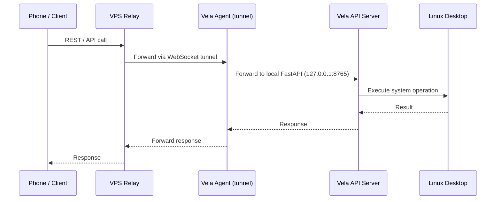
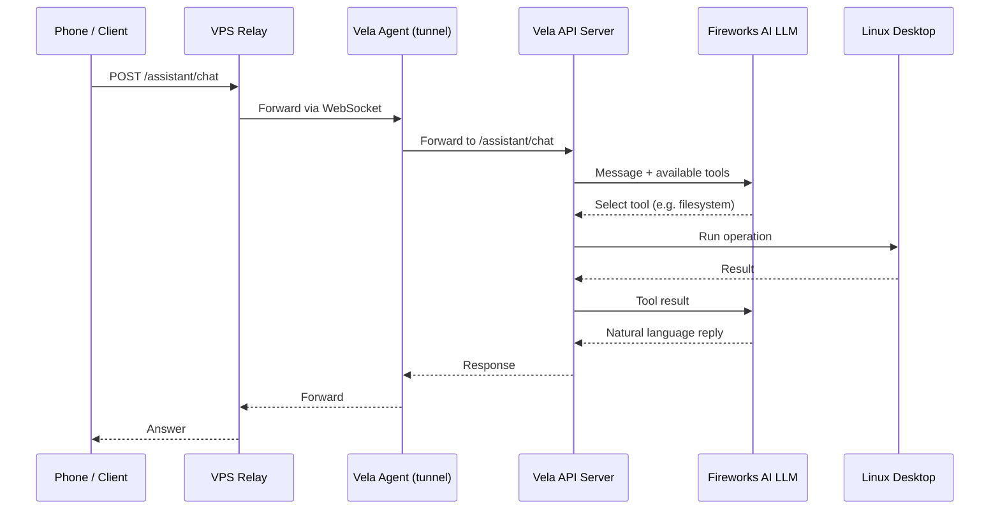
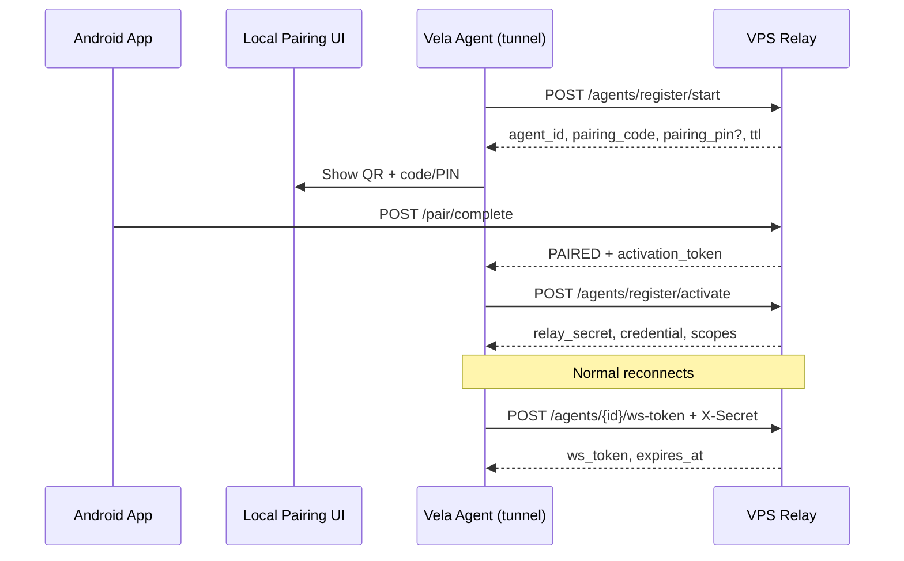

# How Vela Works

Read this before setup if you want the mental model first. The [README](../README.md) covers installation and day-to-day commands.

## One sentence

**Vela is a local Linux remote-control API on your PC, plus a tunnel that lets your phone reach it through a VPS — with an optional AI layer that turns chat into API calls.**

---

## Two processes, two jobs

Most confusion comes from mixing these up:

| Process | Command | systemd unit | Job |
|---------|---------|--------------|-----|
| **Vela API** | `vela` | `vela.service` | FastAPI on `127.0.0.1:8765`. Executes desktop operations. |
| **Vela Agent** | `vela-agent` | `vela-agent.service` | WebSocket to VPS. Forwards phone requests to the local API. |

- **API = hands** — runs `systemctl`, reads files, controls audio, etc.
- **Agent = phone line** — carries requests in and responses out

They are separate user services so one can restart without killing the other.

---

## Remote access: the tunnel

Your phone does not connect to your home IP directly. It talks to a **VPS relay**. The agent on your PC keeps an **outbound** WebSocket to that relay.

```
Phone  →  VPS relay  →  WebSocket  →  vela-agent  →  HTTP 127.0.0.1:8765  →  Vela API  →  Linux
```

When the relay receives a request, it sends JSON over the tunnel: method, path, body, headers. The agent calls the local API and returns the response upstream.

Implementation: `app/agent/tunnel.py` (forward loop), `app/agent/loop.py` (reconnect + token refresh).

### Direct command flow



---

## A normal API call (no AI)

Every feature follows the same pattern:

```
Router  →  Service  →  OS command / library
```

Example: `GET /maintenance/services`

1. `app/routers/maintenance.py` — HTTP handler
2. `app/services/maintenance.py` — runs `systemctl`, parses output
3. `app/domain/maintenance.py` — response schema

Routers are the menu. Services are the kitchen. Domain models define the plate shape.

Most endpoints shell out to Linux tools (`systemctl`, `pactl`, `nmcli`, …) or use libraries like `psutil`. Missing tools do not crash the app — that feature returns an error.

Convention: feature `X` → `routers/X.py` → `services/X.py` → `domain/X.py`.

---

## The assistant (AI layer)

The assistant is not separate infrastructure. It is the same API with an LLM in front:

1. User sends chat to `/assistant/chat` or `/assistant/stream`
2. Vela sends the message + tool catalog (`app/services/assistant/tools.py`) to Fireworks
3. LLM replies with tool calls (`list_services`, `lock_screen`, …)
4. Vela executes those tools — mostly the same REST endpoints
5. Results go back to the LLM for a natural-language answer

| Mode | You provide | Vela provides |
|------|-------------|---------------|
| Direct API | Endpoint + args | Execution |
| Assistant | Natural language | Tool selection + summary |

Destructive actions can require PIN confirmation (`app/services/assistant/safety.py`).

### AI assistant flow



---

## Auth: two trust layers

| Layer | Protects | Credentials |
|-------|----------|-------------|
| **Local API auth** | Requests to FastAPI on your PC | `USERNAME` / `PASSWORD` → JWT from `/auth/token` |
| **Relay auth** | Agent ↔ VPS tunnel | `AGENT_ID`, `RELAY_SECRET`, pairing flow |

The agent obtains a local JWT (`app/agent/local_auth.py`) so tunneled requests can call the API. Your phone authenticates through the VPS separately.

---

## Setup and pairing

`vela --setup` is a fresh-start orchestrator:

1. Wipe old relay secrets and cached local tokens
2. Collect config (browser wizard or terminal)
3. Write `config.yaml` + `.env` in the **current working directory**
4. Write systemd units pointing at that directory
5. Pair with the VPS (QR / code / PIN)
6. Restart services

### Registration flow



After pairing, credentials live in the `.env` file that `vela-agent.service` loads — which may not be the `.env` in your git checkout if setup was run from another directory.

**Edit the live credentials file:**

```bash
vela --env        # opens the .env systemd actually uses
vela --restart    # reload after saving
```

---

## What starts when the API boots

On startup (`app/main.py` lifespan):

- Audit log database (SQLite)
- Background scheduler (cron-like jobs)
- Maintenance prune schedule
- Optional alert monitoring (email/push if configured)
- Desktop session env refresh (for GUI commands under systemd)

The agent loop can run inside the API process (`START_AGENT=true`) or as a separate `vela-agent.service` (typical production setup).

---

## Configuration files

| File | Purpose |
|------|---------|
| `.env` | Secrets, relay credentials, integration API keys |
| `config.yaml` | Server: host, port, JWT secret, allowed dirs, rate limits |
| `~/.config/vela/desktop.env` | Display/session vars for GUI commands under systemd |

`.env` load order (first existing file wins):

1. Current working directory (what systemd `WorkingDirectory` points to)
2. `~/.config/vela/.env`
3. Project root `.env`

---

## Layer responsibilities

| Layer | Does | Doesn't |
|-------|------|---------|
| **Phone / Client** | Sends requests, displays results | Execute system commands |
| **VPS Relay** | Routes via WebSocket, manages pairing | Run desktop operations |
| **Vela Agent** | Maintains tunnel, forwards HTTP locally | Execute `systemctl`, etc. |
| **Vela API** | Runs operations, assistant, auth, safety | Connect to VPS directly |
| **LLM (Fireworks)** | Understands language, picks tools | Touch the OS directly |
| **Linux Desktop** | Runs files, audio, processes, … | Make decisions |

---

## Code map

```
app/
  main.py          FastAPI entry, lifespan, router wiring
  cli.py           vela --setup / --start / --env / …
  auth.py          JWT login
  routers/         HTTP endpoints (thin)
  services/        Business logic + shell commands
  domain/          Request/response schemas
  agent/           Tunnel, pairing, reconnect loop
  setup/           Fresh-start setup wizard
  db/              Audit log, pending actions
  services/assistant/   LLM tools, execution, streaming
```

Further reading:

- [API reference](API_DOCUMENTATION.md) — request/response shapes (may lag code; check routers when unsure)
- [Android scheduler & maintenance](ANDROID_SCHEDULER_AND_MAINTENANCE.md) — client integration notes
- [AGENTS.md](../AGENTS.md) — quick index for AI/code navigation

---

## Explain it in 30 seconds

> I run a small web server on my Linux PC that can control the machine — volume, files, power, services. My phone doesn't hit my home network directly; a VPS holds a persistent connection from my PC, and my Android app talks to that relay. When I use the AI assistant, it translates natural language into those same API calls.

That is the whole product. Everything else is reliability: reconnect, auth, rate limits, audit log, scheduler, alerts.
